# Ether Data Documentation

> **Comprehensive documentation for the Mux-Mesh spatio-temporal data workspace**

## 🌟 Welcome

Mux-Mesh is a comprehensive spatio-temporal data workspace designed for building scalable data processing solutions on Google Cloud Platform. This documentation provides detailed guides, API references, and architectural insights for all components within the ecosystem.

## 🚀 Quick Start

**New to Mux-Mesh?** Start here:
1. 📖 **[Architecture Overview](#️-architecture-overview)** - Understand the system design
2. 🔧 **[Core Projects](#-core-projects)** - Explore the main components  
3. 📚 **[Guides & References](#-guides--references)** - Learn how to use the system
4. 🔍 **[Quick Navigation](#-quick-navigation)** - Find what you need fast

## 📚 Documentation Index

### 🔧 Core Projects

#### 🌐 API Services
Our microservices architecture provides specialized data processing capabilities:

- **[🚪 APIs Gateway](projects/apis/gateway/README.md)**
  - Central API gateway for request routing and management
  - Authentication, rate limiting, and load balancing
  - **[📋 Deployment Guide](projects/apis/gateway/deployment.md)**

- **[📊 Census Data](projects/apis/census/README.md)**
  - US Census demographic data API with natural language querying
  - Flexible geography inputs (ZIP, DMA, city, county, coordinates, etc.)
  - AI-powered SQL generation and H3 spatial indexing

- **[🗺️ Overture Maps](projects/apis/overture/README.md)**
  - Open geographic data processing and serving
  - Overture Maps data integration and API endpoints
  - Spatial data queries and visualization support

- **[🚦 TomTom Flow](projects/apis/tomtom-flow/README.md)**
  - Real-time traffic flow data processing API
  - TomTom API integration and data transformation
  - Historical and live traffic analytics

#### 🔄 Data Pipelines
Automated data collection and processing workflows:

- **[📊 TomTom Traffic Pipeline](projects/tomtom-intermediate-traffic/README.md)**
  - Real-time traffic data collection from TomTom Intermediate Traffic API
  - OpenLR binary data processing and WKT geometry conversion
  - BigQuery integration with intelligent staging and partitioning

### 📖 Guides & References

Essential documentation for users and developers:

- **[🌍 Geography Input Guide](guides/geography-input.md)**
  - Comprehensive guide for handling geographic input data
  - Coordinate systems, projections, and data formats
  - Best practices for spatial data processing

- **[🛠️ Utilities & Scripts](utilities/scripts.md)**
  - Documentation for utility scripts and development tools
  - Automation helpers and maintenance scripts
  - Development workflow enhancements

## 🏗️ Architecture Overview

### System Components

### 🌐 API Services Layer
- **Gateway Service**: Centralized entry point with routing, authentication, and monitoring
- **Overture Service**: Geographic data processing and Overture Maps integration
- **TomTom Flow Service**: Real-time traffic data processing and analytics

### 🔄 Data Processing Layer
- **TomTom Traffic Pipeline**: Automated data collection with intelligent scheduling
- **OpenLR Processing**: Binary traffic data conversion to standard formats
- **BigQuery Integration**: Efficient data warehousing with partitioning strategies

### 🛠️ Infrastructure Layer
- **Shared Utilities**: Common logging, monitoring, and development tools
- **Cloud-Native Design**: Google Cloud Platform integration and best practices
- **Standardized Tooling**: Consistent development patterns across all projects

## 🚀 Key Capabilities

### 📊 Data Processing
- **Real-time ingestion**: Live traffic flow data collection and processing
- **Batch processing**: Historical data analysis and reporting
- **Spatial operations**: Geographic data transformation and analysis
- **Format conversion**: OpenLR to WKT geometry processing

### 🔧 Infrastructure
- **Scalable architecture**: Auto-scaling on Google Cloud Platform
- **Efficient storage**: BigQuery partitioning and compression
- **Automated scheduling**: Cloud Run Jobs with Cloud Scheduler
- **Monitoring & logging**: Comprehensive observability stack

### 🌐 API Features
- **RESTful APIs**: Standard HTTP interfaces for all services
- **Authentication**: Secure access control and API key management
- **Rate limiting**: Protection against abuse and overuse
- **Documentation**: Interactive API documentation and examples

## 🔍 Quick Navigation

| 🎯 I want to... | 📍 Go here |
|------------------|------------|
| **Understand the system** | [Architecture Overview](#️-architecture-overview) |
| **Set up API gateway** | [Gateway Documentation](projects/apis/gateway/README.md) |
| **Query census data** | [Census API Guide](projects/apis/census/README.md) |
| **Work with maps data** | [Overture Maps Guide](projects/apis/overture/README.md) |
| **Process traffic data** | [TomTom Flow API](projects/apis/tomtom-flow/README.md) |
| **Set up data pipeline** | [Traffic Pipeline Guide](projects/tomtom-intermediate-traffic/README.md) |
| **Handle geographic data** | [Geography Input Guide](guides/geography-input.md) |
| **Use utility scripts** | [Utilities Documentation](utilities/scripts.md) |
| **Deploy to production** | [Gateway Deployment](projects/apis/gateway/deployment.md) |

## 🔗 External Resources

### 📖 Documentation & Guides
- **[Main Repository](https://github.com/ether-data/mux-mesh)** - Source code and development setup
- **[Google Cloud Documentation](https://cloud.google.com/docs)** - Platform documentation
- **[BigQuery Documentation](https://cloud.google.com/bigquery/docs)** - Data warehouse setup

### 🌐 Data Sources & APIs
- **[TomTom Traffic API](https://developer.tomtom.com/traffic-api)** - Real-time traffic data
- **[Overture Maps](https://overturemaps.org/)** - Open geographic data
- **[OpenLR Specification](https://www.openlr.org/)** - Location referencing standard

### 🛠️ Development Tools
- **[uv Package Manager](https://docs.astral.sh/uv/)** - Python dependency management
- **[FastAPI Documentation](https://fastapi.tiangolo.com/)** - API framework
- **[Google Cloud SDK](https://cloud.google.com/sdk)** - Cloud deployment tools

