# Ether API Gateway

A unified API gateway that combines all microservices into a single entry point.

## Overview

The API Gateway serves as the single point of entry for all client requests, routing them to the appropriate microservices. It provides:

- **Unified Interface**: Single endpoint for all APIs
- **Service Discovery**: Dynamic discovery of available services and endpoints
- **Health Monitoring**: Comprehensive health checks for all services
- **Request Logging**: Detailed request/response logging
- **CORS Support**: Configurable cross-origin resource sharing
- **API Documentation**: Combined OpenAPI documentation

## Architecture



The API Gateway serves as a unified entry point that routes client requests to specialized microservices, each connected to their respective data sources and featuring unique capabilities.

### Service Overview

**📊 Census API** (`/census`)
- **Purpose**: US demographic data with natural language querying
- **Data Source**: BigQuery GCP with H3 spatial indexing
- **Features**: AI-powered SQL generation, flexible geography inputs

**🗺️ Overture API** (`/overture`) 
- **Purpose**: Places and points of interest with spatial queries
- **Data Source**: Overture Maps open geographic data
- **Features**: Category mapping, spatial data processing

**🚦 TomTom Flow API** (`/tomtom-flow`)
- **Purpose**: Real-time traffic flow analytics
- **Data Source**: TomTom API live traffic feeds
- **Features**: Traffic analytics, real-time monitoring

### Key Benefits

- **Single Entry Point**: One gateway URL for all services
- **Unified Documentation**: Combined OpenAPI specs at `/docs`
- **Health Monitoring**: Centralized health checks across all services
- **Flexible Geography**: Consistent geography input handling across APIs

## Quick Start

### Local Development

```bash
# Run the gateway locally (from workspace root)
./proj/apis/gateway/run-local.sh

# This will:
# - Navigate to workspace root automatically
# - Use uv to manage dependencies and virtual environment
# - Run the gateway server with proper workspace setup
```

### Cloud Deployment

```bash
# Deploy to Google Cloud Run
./proj/apis/gateway/deployment/deploy.sh your-project-id us-central1
```

### Access Points

**Local Development:**
- Gateway root: http://localhost:8000/
- Combined docs: http://localhost:8000/docs
- Health status: http://localhost:8000/health

**Production (after deployment):**
- Gateway will be available at the Cloud Run service URL
- All endpoints remain the same but with the production domain


## Gateway Endpoints

### Service Discovery
- `GET /api/services` - List all available services
- `GET /api/services/{service_name}` - Get service details
- `GET /api/endpoints` - List all endpoints across services
- `GET /api/endpoints/by-tag/{tag}` - Filter endpoints by tag

### Health Monitoring
- `GET /health` - Overall system health
- `GET /health/gateway` - Gateway-only health

### Root
- `GET /` - Gateway information and service overview

## Configuration

The gateway can be configured via environment variables:

```bash
# Gateway settings
GATEWAY_HOST                    # Production host
GATEWAY_PORT=8000               # Port to run on
ENVIRONMENT=development         # Environment (development/staging/production)

# Service discovery
ENABLE_SERVICE_DISCOVERY=true  # Enable service discovery

# Health checks
HEALTH_CHECK_INTERVAL=30       # Health check interval (seconds)

# CORS
CORS_ORIGINS=["*"]             # Allowed origins

# Rate limiting (future)
RATE_LIMIT_REQUESTS=100        # Requests per minute
```

## Adding New APIs

To add a new microservice to the gateway:

1. **Add dependency** in `pyproject.toml`:
   ```toml
   dependencies = [
       # ... existing deps
       "your-new-api",
   ]
   
   [tool.uv.sources]
   your-new-api = { workspace = true }
   ```

2. **Import and mount** in `main.py`:
   ```python
   from your_new_api.main import app as new_api_app
   
   # Mount the new API
   app.mount("/new-api", new_api_app)
   ```

3. **Update service registry** in `routes/discovery.py`:
   ```python
   services = {
       # ... existing services
       "new-api": ServiceInfo(
           name="new-api",
           version="1.0.0",
           description="Description of new API",
           base_path="/new-api",
           docs_url="/new-api/docs",
           health_url="/health/new-api",
           endpoints=[
               # Define endpoints...
           ]
       )
   }
   ```

4. **Add health check** in `routes/health.py`:
   ```python
   services_to_check = {
       # ... existing services
       "new-api": "/new-api/health"
   }
   ```

## Middleware

The gateway includes several middleware components:

### CORS Middleware
- Configurable origins
- Supports all HTTP methods
- Exposes custom headers

### Request Logging Middleware
- Logs all requests and responses
- Tracks processing time
- Adds timing headers

## Development

### Running in Development
```bash
# Using the local run script (recommended)
./proj/apis/gateway/run-local.sh

# Alternative - direct execution with hot reload
ENVIRONMENT=development uv run --directory proj/apis/gateway python -m gateway.server
```

### Testing
```bash
# Run tests
cd proj/apis/gateway
uv run pytest
```

## Cloud Run Deployment

### Architecture

- **Cloud Run Service**: Hosts the containerized gateway application
- **Container Registry**: Stores built Docker images
- **Horizontal Scaling**: Automatically scales based on traffic (0-10 instances)
- **Health Monitoring**: Built-in health checks and logging

### Deployment Process

1. **Build container** using Cloud Build
2. **Push to Container Registry**
3. **Deploy to Cloud Run** with production configuration
4. **Verify deployment** with automated health checks

### Configuration

Environment variables set for production deployment:
- `ENVIRONMENT=production`
- `GATEWAY_PORT=8000`
- `CORS_ORIGINS=*`
- Memory: 2Gi
- CPU: 2 cores
- Concurrency: 100 requests per instance
- Timeout: 300 seconds

### Monitoring

View logs and metrics:
```bash
# View recent logs
gcloud logging read 'resource.type="cloud_run_revision" AND resource.labels.service_name="ether-gateway"' --limit=50

# Get service status
gcloud run services describe ether-gateway --region=us-central1
```

## API Documentation

The gateway provides unified OpenAPI documentation at `/docs`. 
